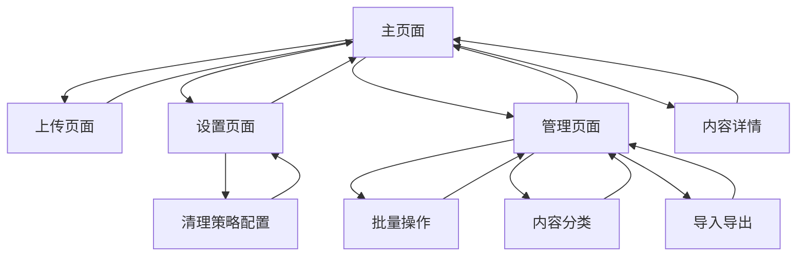

# 剪切板同步服务产品需求文档

## 1. 产品概述

一个跨设备的剪切板同步服务，支持文字、图片的实时同步和管理。用户可以在任意设备上复制内容，并通过WebSocket协议实时同步到其他设备上快速访问和使用。

产品旨在解决用户在多设备间传输剪切板内容的痛点，提供便捷的跨平台内容同步体验。

## 2. 核心功能

### 2.1 访问模式

本产品采用局域网直接访问模式，无需用户注册或登录验证，任何设备都可以直接访问和使用所有功能。

### 2.2 功能模块

我们的剪切板同步服务包含以下主要页面：

1. **主页面**：剪切板内容列表、时间分段显示、搜索筛选功能、一键复制操作、参数类型获取
2. **上传页面**：支持文字、图片的上传和预览，提供完整的内容编辑界面
3. **设置页面**：设备管理、WebSocket连接设置、存储清理、清理策略配置
4. **管理页面**：批量操作、内容分类管理、导入导出功能

### 2.3 页面详情

| 页面名称 | 模块名称  | 功能描述                      |
| ---- | ----- | ------------------------- |
| 主页面  | 内容列表  | 按时间戳分段显示所有剪切板内容，支持滚动加载    |
| 主页面  | 一键复制  | 每个内容项提供复制按钮，支持文字、图片复制     |
| 主页面  | 搜索筛选  | 支持按内容类型、时间范围筛选，关键词搜索      |
| 主页面  | 参数获取  | 支持获取所有文本、获取所有图片、获取最新xx个信息 |
| 主页面  | 响应式布局 | 适配桌面端和移动端，小屏模式优化显示        |
| 上传页面 | 文字上传  | 支持纯文本内容的输入和上传             |
| 上传页面 | 图片上传  | 支持图片文件上传，自动转换为base64存储    |
| 上传页面 | 内容预览  | 上传前预览内容，确认后提交             |
| 上传页面 | 实时同步  | 通过WebSocket协议实时同步到所有连接设备  |
| 设置页面 | 设备管理  | 查看已连接设备列表，管理WebSocket连接状态 |
| 设置页面 | 存储管理  | 查看存储使用情况，清理过期内容           |
| 设置页面 | 连接设置  | 配置WebSocket连接参数，重连策略      |
| 设置页面 | 清理策略  | 配置自动清理规则：按数量清理、按时间清理      |
| 管理页面 | 批量操作  | 支持批量删除、批量导出、批量分类          |
| 管理页面 | 内容分类  | 按类型、标签对剪切板内容进行分类管理        |
| 管理页面 | 导入导出  | 支持剪切板内容的备份和恢复功能           |

## 3. 核心流程

**用户操作流程：**

1. 用户访问主页面，查看当前所有剪切板内容，支持搜索和筛选
2. 点击上传按钮，选择要同步的内容类型（文字/图片/文件）
3. 在上传页面输入或选择内容，实时预览，确认后上传
4. 内容通过WebSocket协议实时同步到所有设备，在主页面按时间分段显示
5. 支持参数类型获取：获取所有文本、获取所有图片、获取最新xx个信息（包含文本、图片）
6. 用户可点击任意内容的复制按钮，快速复制到本地剪切板
7. 通过设置页面管理设备信息、存储空间和清理策略
8. 在管理页面进行批量操作、内容分类和数据备份

**网页端功能完整性：**

* 提供完整的用户操作界面，无需依赖API调用工具

* 支持所有剪切板操作：查看、上传、复制、删除、搜索

* 提供直观的配置管理界面，用户可直接修改清理策略

* 响应式设计，适配桌面端和移动端使用场景

## 4. 用户界面设计

### 4.1 设计风格

* **主色调**：#2563eb（蓝色）、#f8fafc（浅灰背景）

* **辅助色**：#10b981（绿色成功）、#ef4444（红色警告）

* **按钮样式**：圆角设计，悬停效果，扁平化风格

* **字体**：系统默认字体，主要文字14px，标题18px

* **布局风格**：卡片式布局，顶部导航，响应式网格

* **图标风格**：线性图标，简洁现代

### 4.2 页面设计概览

| 页面名称 | 模块名称 | UI元素                            |
| ---- | ---- | ------------------------------- |
| 主页面  | 内容列表 | 卡片式布局，每个内容项包含类型图标、内容预览、时间戳、复制按钮 |
| 主页面  | 时间分段 | 按日期分组显示，使用分割线和日期标签              |
| 主页面  | 搜索栏  | 顶部固定搜索框，支持实时搜索和筛选按钮             |
| 上传页面 | 上传区域 | 拖拽上传区域，支持点击选择文件，实时预览            |
| 上传页面 | 内容编辑 | 文字输入框，图片预览，文件信息显示               |
| 设置页面 | 设备列表 | 表格形式显示设备信息，包含设备名称、最后同步时间，无权限控制  |
| 设置页面 | 存储统计 | 进度条显示存储使用情况，清理按钮                |

### 4.3 响应式设计

产品采用移动端优先的响应式设计，在小屏设备上优化触摸交互和内容显示密度。桌面端提供更丰富的功能和更大的内容展示区域。

 

# 注意

1. 每次编写完成一个阶段后需要运行语法检查进行修复错误

