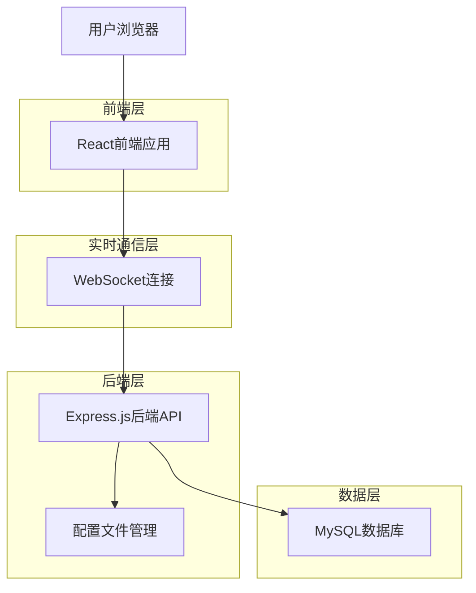
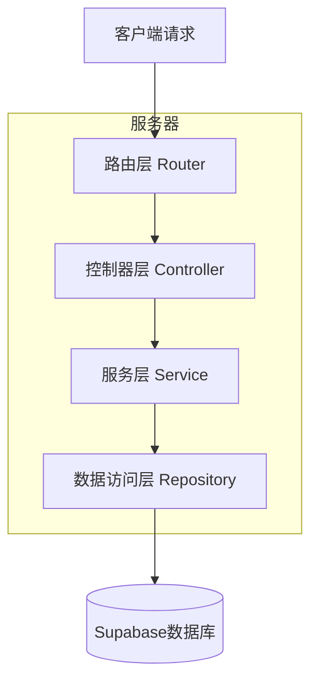
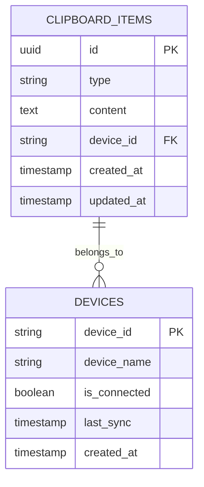

# 剪切板同步服务技术架构文档

## 1. 架构设计



## 2. 技术描述

* **前端**: React\@18 + TypeScript + Tailwind CSS + Vite + WebSocket客户端

* **后端**: Express\@4 + TypeScript + WebSocket服务器 + mysql2

* **数据库**: MySQL 8.0

* **实时通信**: WebSocket协议进行设备间同步

* **配置管理**: 本地JSON配置文件（数据库连接、WebSocket设置、清理策略）

## 3. 路由定义

| 路由        | 用途                             |
| --------- | ------------------------------ |
| /         | 主页面，显示剪切板内容列表，提供完整的用户操作界面      |
| /upload   | 上传页面，支持文字、图片上传的完整界面            |
| /settings | 设置页面，设备管理、WebSocket连接设置、清理策略配置 |
| /api/\*   | RESTful API接口，供程序调用            |
| /ws       | WebSocket连接端点，用于实时同步           |

## 4. API定义

### 4.1 核心API

**获取剪切板内容列表**

```
GET /api/clipboard
```

请求参数:

| 参数名    | 参数类型   | 是否必需  | 描述                                |
| ------ | ------ | ----- | --------------------------------- |
| page   | number | false | 页码，默认1                            |
| limit  | number | false | 每页数量，默认20                         |
| type   | string | false | 内容类型筛选：text/image                 |
| search | string | false | 搜索关键词                             |
| filter | string | false | 参数类型：all\_text/all\_images/latest |

响应:

| 参数名     | 参数类型             | 描述      |
| ------- | ---------------- | ------- |
| success | boolean          | 请求状态    |
| data    | ClipboardItem\[] | 剪切板内容列表 |
| total   | number           | 总数量     |

示例:

```json
{
  "success": true,
  "data": [
    {
      "id": "uuid",
      "type": "text",
      "content": "Hello World",
      "deviceId": "device-123",
      "createdAt": "2024-01-01T00:00:00Z"
    }
  ],
  "total": 100
}
```

**上传剪切板内容**

```
POST /api/clipboard
```

请求:

| 参数名      | 参数类型   | 是否必需 | 描述                  |
| -------- | ------ | ---- | ------------------- |
| type     | string | true | 内容类型：text/image     |
| content  | string | true | 内容数据（文字内容或图片base64） |
| deviceId | string | true | 设备标识                |

响应:

| 参数名     | 参数类型          | 描述     |
| ------- | ------------- | ------ |
| success | boolean       | 上传状态   |
| data    | ClipboardItem | 创建的内容项 |

**删除剪切板内容**

```
DELETE /api/clipboard/:id
```

**获取设备列表**

```
GET /api/devices
```

**清理过期内容**

```
POST /api/cleanup
```

请求:

| 参数名   | 参数类型          | 是否必需  | 描述                        |
| ----- | ------------- | ----- | ------------------------- |
| type  | string        | false | 清理类型：count/date，默认按配置文件执行 |
| value | number/string | false | 清理参数：数量或日期                |

**获取配置信息**

```
GET /api/config
```

**更新配置信息**

```
PUT /api/config
```

**WebSocket连接端点**

```
WS /ws
```

WebSocket消息格式:

| 消息类型             | 描述         | 数据格式                                 |
| ---------------- | ---------- | ------------------------------------ |
| sync             | 同步新内容到所有设备 | {type: 'sync', data: ClipboardItem}  |
| delete           | 删除内容通知     | {type: 'delete', id: string}         |
| get\_all\_text   | 获取所有文本内容   | {type: 'get\_all\_text'}             |
| get\_all\_images | 获取所有图片内容   | {type: 'get\_all\_images'}           |
| get\_latest      | 获取最新xx个内容  | {type: 'get\_latest', count: number} |

## 5. 服务器架构图



## 6. 数据模型

### 6.1 数据模型定义



### 6.2 数据定义语言

**剪切板内容表 (clipboard\_items)**

```sql
-- 创建表
CREATE TABLE clipboard_items (
    id VARCHAR(36) PRIMARY KEY DEFAULT (UUID()),
    type ENUM('text', 'image') NOT NULL,
    content TEXT NOT NULL,
    device_id VARCHAR(100) NOT NULL,
    created_at TIMESTAMP DEFAULT CURRENT_TIMESTAMP,
    updated_at TIMESTAMP DEFAULT CURRENT_TIMESTAMP ON UPDATE CURRENT_TIMESTAMP
);

-- 创建索引
CREATE INDEX idx_clipboard_items_device_id ON clipboard_items(device_id);
CREATE INDEX idx_clipboard_items_created_at ON clipboard_items(created_at DESC);
CREATE INDEX idx_clipboard_items_type ON clipboard_items(type);
```

**设备表 (devices)**

```sql
-- 创建表
CREATE TABLE devices (
    device_id VARCHAR(100) PRIMARY KEY,
    device_name VARCHAR(100) NOT NULL,
    user_agent TEXT,
    is_connected BOOLEAN DEFAULT FALSE,
    last_sync TIMESTAMP DEFAULT CURRENT_TIMESTAMP,
    created_at TIMESTAMP DEFAULT CURRENT_TIMESTAMP
);

-- 创建索引
CREATE INDEX idx_devices_last_sync ON devices(last_sync DESC);

-- 初始化数据
INSERT INTO devices (device_id, device_name, user_agent) VALUES 
('demo-device-1', '演示设备1', 'Mozilla/5.0 Demo Browser'),
('demo-device-2', '演示设备2', 'Mozilla/5.0 Demo Mobile');
```

**TypeScript类型定义**

```typescript
// 剪切板内容项类型
export interface ClipboardItem {
  id: string;
  type: 'text' | 'image';
  content: string;
  deviceId: string;
  createdAt: string;
  updatedAt: string;
}

// 设备类型
export interface Device {
  deviceId: string;
  deviceName: string;
  userAgent?: string;
  isConnected: boolean;
  lastSync: string;
  createdAt: string;
}

// API响应类型
export interface ApiResponse<T> {
  success: boolean;
  data?: T;
  message?: string;
  total?: number;
}

// 上传请求类型
export interface UploadRequest {
  type: 'text' | 'image';
  content: string;
  deviceId: string;
}

// WebSocket消息类型
export interface WebSocketMessage {
  type: 'sync' | 'delete' | 'get_all_text' | 'get_all_images' | 'get_latest';
  data?: any;
  id?: string;
  count?: number;
}

// 应用配置文件结构
export interface AppConfig {
  database: DatabaseConfig;
  websocket: WebSocketConfig;
  cleanup: CleanupConfig;
}

// MySQL数据库连接配置
export interface DatabaseConfig {
  host: string;
  port: number;
  user: string;
  password: string;
  database: string;
  charset: string;
}

// WebSocket配置
export interface WebSocketConfig {
  port: number; // WebSocket服务端口
  heartbeatInterval: number; // 心跳检测间隔（毫秒）
  reconnectInterval: number; // 重连间隔（毫秒）
  maxReconnectAttempts: number; // 最大重连次数
}

// 清理策略配置
export interface CleanupConfig {
  enabled: boolean; // 是否启用自动清理
  strategy: 'count' | 'date' | 'both'; // 清理策略
  maxCount?: number; // 最大保留数量
  beforeDate?: string; // 清理指定日期之前的内容
  autoCleanInterval?: number; // 自动清理间隔（小时）
}
```

### 6.3 配置文件示例

**config.json**

```json
{
  "database": {
    "host": "localhost",
    "port": 3306,
    "user": "clipboard_user",
    "password": "your_password",
    "database": "clipboard_db",
    "charset": "utf8mb4"
  },
  "websocket": {
    "port": 8080,
    "heartbeatInterval": 30000,
    "reconnectInterval": 5000,
    "maxReconnectAttempts": 5
  },
  "cleanup": {
    "enabled": false,
    "strategy": "count",
    "maxCount": 100,
    "autoCleanInterval": 24
  }
}
```

**清理策略说明：**

* `count`策略：当剪切板内容达到`maxCount`数量时，删除最旧的1条记录

* `date`策略：删除`beforeDate`指定日期之前的所有内容

* `both`策略：同时应用数量和日期限制

* WebSocket连接管理：支持心跳检测、自动重连、连接状态监控

